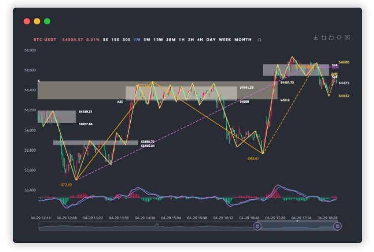
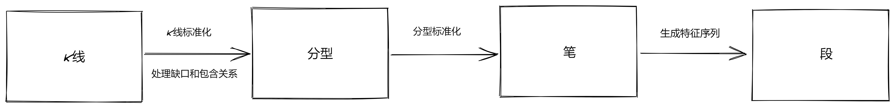
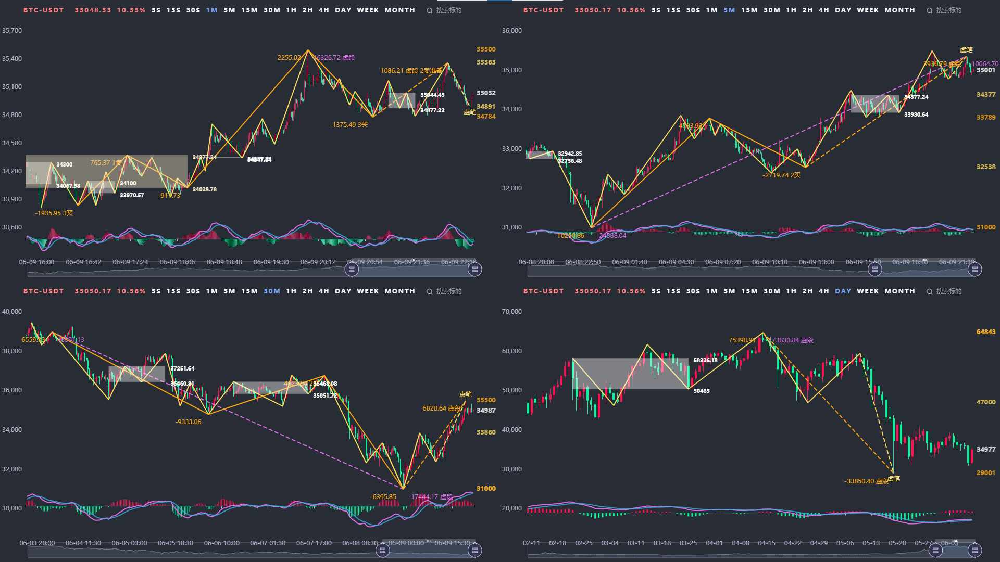

# 壹缠 - 缠论(缠中说禅)技术分析

聚焦于多级别K线走势分析 实时自动分解走势 笔段画线、中枢标识 递归分析整体走势 作为买卖分析参考

地址: <https://one-quant.com/#/twist> (默认标的为上证指数 搜索框可检索标的)

## 回放和实时买卖点判断

https://user-images.githubusercontent.com/2844717/122881625-f168b800-d36d-11eb-9f83-ad7cefc7af2d.mp4

## 支持标的 

- 沪深证券
- 港股&美股
- 国内期货
- 加密货币

## VIP & SVIP服务

- VIP服务
  - 5s 15s 30s 秒级别K线 逐秒观察市场 🔥
  - 逐K行情回放 分析复盘利器 👍
  - 全市场行情 支持加密货币、期货和港美股
- SVIP服务
  - 实时标注缠论三类买卖点 🔥
  - 缠论买卖点选股器 支持沪深市场股票、国内期货 👍
  - 支持Webhook推送买卖点通知 实时推送企业微信
  - 支持多周期看盘 竖屏三周期、横屏四周期

## 工具使用说明

1. **笔段走势** - 黄线为当前级别K线构成的笔，橙线为基于当前级别笔特征序列生成的段，紫线为基于当前级别段生成的走势
2. **MACD面积** - 笔段走势的末端数字为对应笔段的MACD面积,黄色为笔MACD面积，橙色为段MACD面积，紫色为走势MACD面积。
3. **中枢级别** - 中枢以白色、橙色和紫色框标注，两端数字为中枢上下沿值
4. **K线回放** - 快捷键说明: 空格键(开始/暂停/继续 K线回放)、左箭头 (向前回退一根K线)、右箭头(向后前进一根K线)
5. **图表操作** - 支持滚轮缩放图表、鼠标拖拽移动图表
6. **标的搜索** - 点击搜索图标 可搜索全市场标的 点击返回的搜索结果切换标的
7. **秒级K线** - 交易所不直接提供秒级别K线数据 所以无秒级别历史K线 依据毫秒Tick合并生成实时高精度秒级K线（需在开盘时才能使用）

## 多笔段走势规则配置

支持设置多种笔、段、走势规则 满足交易者的笔段习惯和风格

## 支持多级别联立

多级别联立 判断走势情况 找寻更多的合适买卖点和形态特征

## 支持买卖点选股器

支持全沪深市场、国内期货 批量缠论买卖点分析筛选

支持语义化智能选股，如 板块、技术面、基本面、排序等条件，如 沪深300成分股,年线以上,业绩预增,主力资金流入排序,非st,非新股

## 支持量化策略脚本

支持用户自行实现量化策略 扩展图表标注、买卖信号、推送通知等功能 详见 [策略脚本编程指南](https://github.com/neil-pan-s/twist-quant/blob/main/PROGRAM.md)

## 买卖定式

## 反馈讨论 & Bug提交

<https://github.com/neil-pan-s/twist-quant/issues>

## 缠论量化交流 & 7x24财经快讯推送群

 

